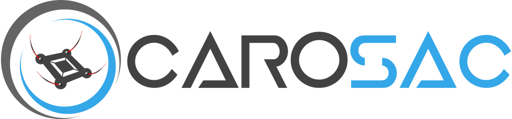
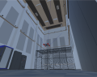
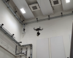

# CaRoSaC: Cable Robot Simulation and Control

This repository provides the official implementation of the paper "CaRoSaC: A Reinforcement Learning Control Approach for Cable-Driven Parallel Robots by Addressing Cable Sag through Simulation"

# Introduction

CaRoSaC is a framework for simulating and controlling Cable-Driven Parallel Robots(CDPR's). The Cable Robot Simulation (CaRoSim) is built on top of Unity3D to simulate realistic behavior of Cable-Driven Parallel Robots(CDPR's) with flexible cables, 
whereas the Cable Robot Control (CaRoCon) integrates a model-free Reinforcement Learning (RL) approach.

 

**Abstract:**  
 This paper introduces the Cable Robot Simulation and Control (CaRoSaC) Framework, which integrates a realistic simulation environment with a model-free reinforcement learning control methodology for Cable-Driven Parallel Robots (CDPRs), accounting for the effects of cable sag. Our approach seeks to bridge the knowledge gap of the intricacies of CDPRs due to aspects such as cable sag and precision control necessities, which are missing in existing research and often overlooked in traditional models, by establishing a simulation platform that captures the real-world behaviors of CDPRs, including the impacts of cable sag. The framework offers researchers and developers a tool to further develop estimation and control strategies within the simulation for understanding and predicting the performance nuances, especially in complex operations where cable sag can be significant. Using this simulation framework, we train a model-free control policy rooted in Reinforcement Learning (RL). This approach is chosen for its capability to adaptively learn from the complex dynamics of CDPRs. The policy is trained to discern optimal cable control inputs, ensuring precise end-effector positioning. Importantly, this autonomous control policy addresses the cable sag issues without being tethered to predefined mathematical models. We also demonstrate that our RL-based controller, coupled with the flexible cable simulation, significantly outperforms the classical kinematics approach, particularly in dynamic conditions and near the boundary regions of the workspace. The combined strength of the described simulation and control approach offers a robust solution to the industry and research community, ensuring that CDPRs function optimally in various applications while accounting for the often neglected but critical factor of cable sag. 

# License
This software is made available to the public to use (_source-available_), licensed under the terms of the BSD-2-Clause-License with no commercial use allowed, the full terms of which are made available in the [LICENSE](./LICENSE) file. No license in patents is granted.

# Citing CaRoSaC

If you use CaRoSaC for academic research, please cite the corresponding paper and consult the [LICENSE](./LICENSE) file for a detailed explanation.

# Getting Started

## Requirements

CaRoSaC was tested with the following setup:

* Linux Version: 20.04
* Unity Version: 2021.3.11f1
* Python Version:  3.9.7
* other non-standard packages: matplotlib==3.7.1, numpy==1.24.3, pandas==1.4.4
* other non-standard packages: tabulate==0.8.2, termcolor==2.3.0, PyYAML==6.0

## Setup Configuration From Paper
   

## Steps To Setup Custom CDPR Configuration
  1. Robot Setup Settings:
  2. Cable Setup Settings:
  3. Obi Solver Settings:

  [//]: # (4. Python Communication Settings:)

  [//]: # (5. RL Control Agent - TD3:)
  
  [//]: # (6. Controller Training Parameters:)

## Running Training and Control Experiments from Paper

## ToDo's: 
  1. Automatic Scriptable Basic Scene Setup

